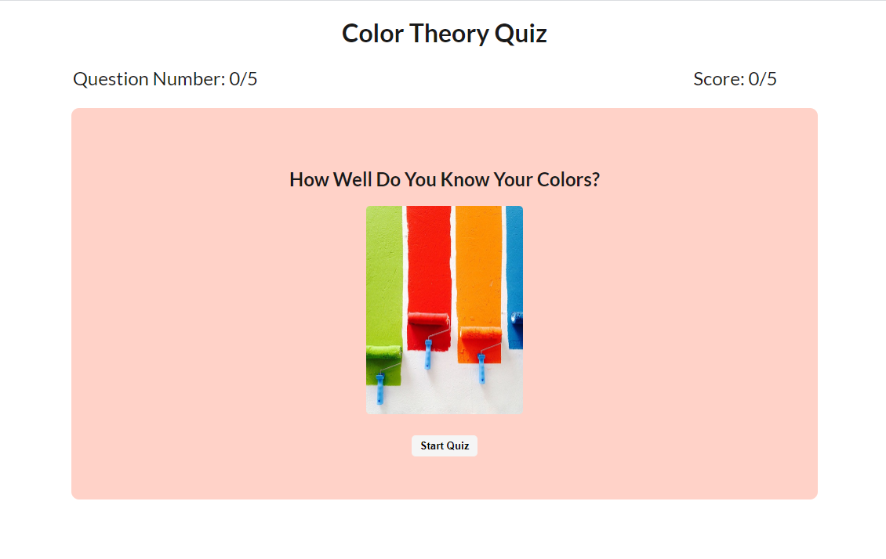
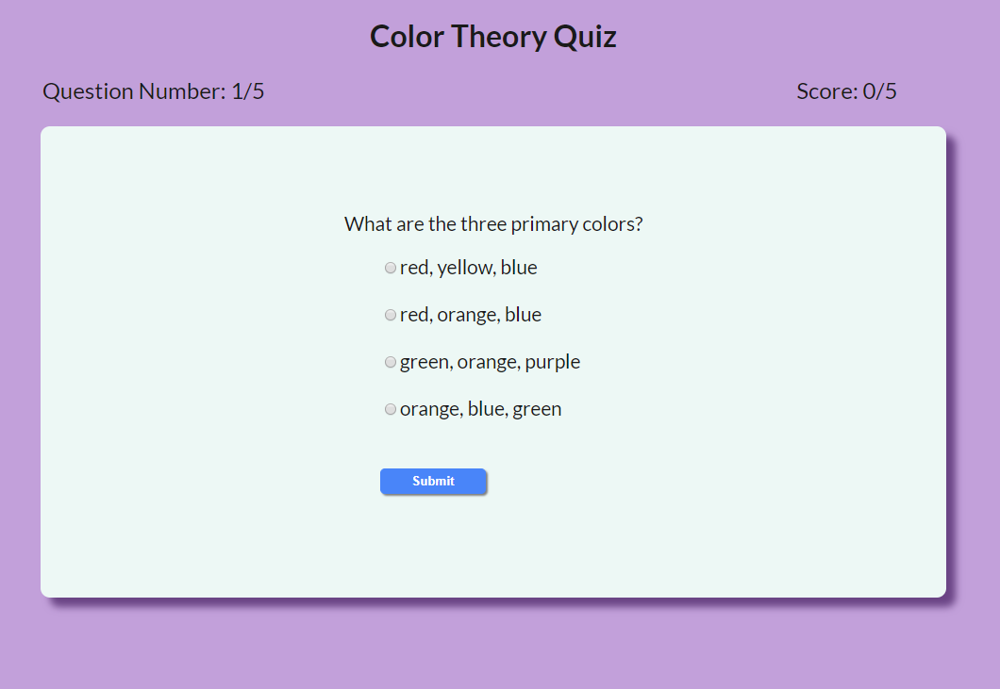
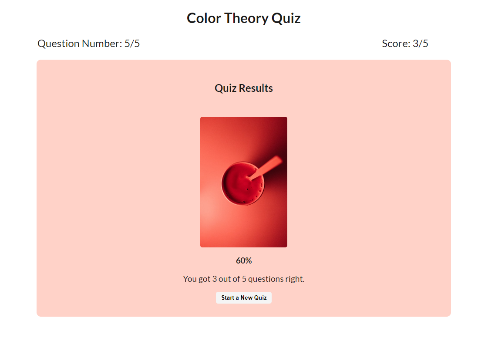

# Color Theory Quizz App
This app quizzes the user on color theory and gives feedback on correct and incorrect answers. The app displays the question number and the current score at the top of the screen throughout the quiz. At the end of the quiz, the user is given a final score by providing a percentage score as well as the number of questions answered correctly.

# Live Link 
(https://neelyab.github.io/quiz-app/)

# Screenshots

# Technology Used

* HTML
* CSS
* Javascript
* jQuery
